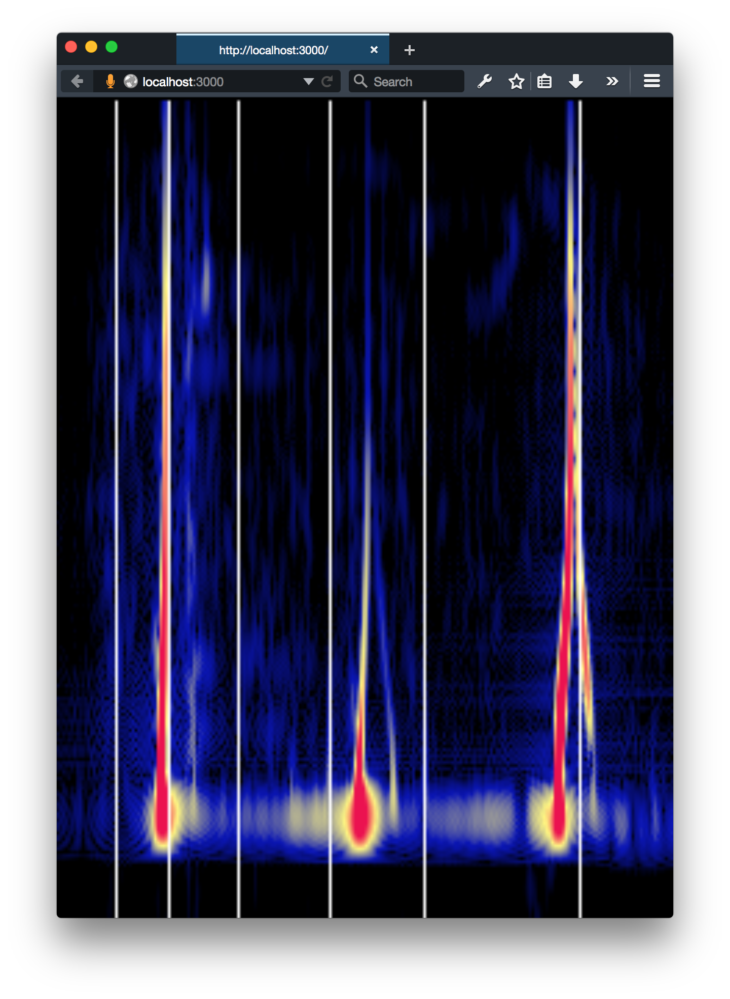

# Web Audio API Raw Guitar Tuner ([demo](http://webaudio-guitar-tuner.meteor.com))

This app uses the [Web Audio API](https://developer.mozilla.org/en-US/docs/Web/API/Web_Audio_API) and [DSP.js](https://github.com/corbanbrook/dsp.js/) to display a real-time waterfall plot of the audio spectrum focused on the frequencies of a guitar in standard tuning.

This app only runs on Firefox right now. Check out the [demo](hhttp://webaudio-guitar-tuner.meteor.com)! Here's a screenshot of me tuning my A string. Notice that since this is the raw signal, you are picking up the harmonics of the string as well. That what you see the A string ringing the high-E string as well. That because the high-E is the second harmonic of the A (right after the octive)!

## Getting Started

This app uses Meteor for convenience, but you could easily convert the coffeescript to javascript and paste into your own app.

    curl https://install.meteor.com/ | sh

Then clone this repo and run it with `meteor` from inside the project directory.

Also, make sure your turn off ambient noise reduction!

